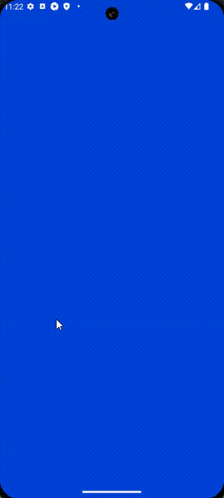
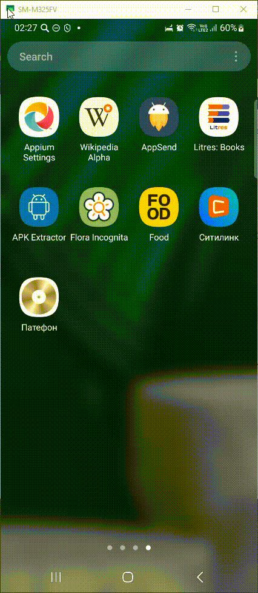

# Проект по автоматизации тестирования мобильного приложения интернет-магазина техники и электронники [Ситилинк](https://www.citilink.ru/) 


## :world_map: Содержание

- [Технологии и инструменты](#gear-технологии-и-инструменты)
- [Список реализованных проверок в автотестах](#white_check_mark-список-реализованных-проверок-в-автотестах)
- [Запуск тестов в Jenkins с параметрами](#rocket-Запуск-тестов-в-Jenkins-с-параметрами)
- [Отчет о результатах тестирования в Allure-reports](#bar_chart-Отчет-о-результатах-тестирования-в-Allure-reports)
- [Статистика запуска тест-планов и отчеты в Allure TestOps](#bar_chart-Статистика-запуска-тест-планов-и-отчеты-в-Allure-TestOps)
- [Уведомление в Telegram о результатах прогона тестов с использованием бота](#email-Уведомление-в-Telegram-о-результатах-прогона-тестов-с-использованием-бота)
- [Видео-отчет прохождения Mobile-автотеста](#movie_camera-Видео-отчет-прохождения-автотеста)


## :dart: Цель проекта

Тестирование основных функций интернет-магазина, позволяющих найти нужный товар, добавить его с корзину или в список Избранных.


## :gear: Технологии и инструменты

<p align="left">


</p>


## :white_check_mark: Список реализованных проверок в автотестах 

## Mobile-тесты
- Поиск товара
- Добавление товара в корзину
- Добавление товара в раздел "Избранные"


## :rocket: Запуск тестов в Jenkins с параметрами

Сборка, параметризация и запуск проекта производятся с помощью Jenkins. При каждом запросе на тестирование браузера Selenoid запускает новый Docker-контейнер и останавливает его после закрытия браузера. 
Запуск тестов возможен как локально, так и удаленно через Jenkins.
Для локального запуска тестов с дефолтными значениями необходимо выполнить команду:

```bash
python -m venv .venv
source .venv/bin/activate
pip install -r requirements.txt
pytest --context=bstack 
```

Удаленный запуск автотестов выполняется на сервере Jenkins. 
Для запуска автотестов в Jenkins необходимо:
1. Открыть сборку в Jenkins 
2. Нажать Build with parameters

По умолчанию используется конфиг BrowserStack. Для изменения конфига необходимо перед запуском тестов через pytest указать параметр context pytest --context=bstack / --context=local_emulator / --context=local_real_device в зависимости от того, где планируется запустить тесты.

По умолчанию используется конфиг BrowserStack

Результат запуска сборки можно посмотреть в отчёте Allure Report и в Allure TestOps


## :bar_chart: Отчет о результатах тестирования в Allure-reports

После прохождения тестов автоматически формируется отчет в Allure Report. Allure формирует подробный отчет о результатах прогона тестов. Кастомные фильтры и листенеры делают отчет максимально понятным. Например, в отчет пишутся все селекторы и методы Selene, отчеты формируются по категориям.
После окончания выполнения автотестов по каждому из них в отчете доступны скриншоты, лог консоли браузера и видеозапись выполнения теста.


Общий результат прогона тестов

<p>

</p>

Список тестов

<p>

</p>

Пример результата прохождения теста

<p>

</p>

## :bar_chart: Статистика запуска тест-планов и отчеты в Allure TestOps

Также настроена интеграция с Allure TestOps., что продоставлят возможность просмотра результата выполнения автотестов, создания ручных тестов, а также через запуск автотестов. В Allure TestOps разработана удобная система предоставления отчетов по результатам запуска тестов. 

### Пример Dashboard с общими результатами тестирования

<p>

</p>

### Общий список всех кейсов, имеющихся в системе

<p>

</p>


### Пример результата прохождения теста

<p>

</p>


## :email: Уведомление в Telegram о результатах прогона тестов с использованием бота

Настроено автоматическое оповещение о результатах прохождения тестов в Telegram-бот с полной информацией о прогоне и ссылкой на Allure


### Результат прогона тестов 

<p>

</p>

## :movie_camera: Видео-отчет прохождения автотеста 

Пример видеозаписи выполнения теста в Browserstack.

<p>

</p>

Пример видеозаписи выполнения теста на эмуляторе в Android Studio.

<p>

</p>

Пример видеозаписи выполнения теста на реальном устройстве.

<p>

</p>
